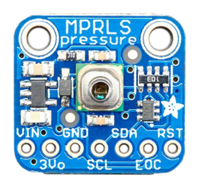

# Librairies pour MicroPython

## Capteurs

### Capteur de température DS18B20 (OneWire)

Lien : [ds18b20/](ds18b20/)

### Capteur de pression absolue Adafruit MPRLS (0-25 PSI)

Lien : [adafruit/mprls/](adafruit/mprls/)

