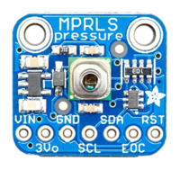

# Adafruit I2C MPRLS

## Présentation

Capteur numérique I2C de pression absolue [Adafruit MPRLS](https://www.adafruit.com/product/3965) (0-25 PSI)




- Capteur : MPRLS (0025PA)
- Mesure :  0 à 25 PSI (0 à 170 kPa) sur 24 bits
- Précision : 1,5% pleine échelle
- Interface : I2C (adresse = 0x18)
- Alimentation : de 3 à 5 V

## Librairie MicroPython

```python
import mprls
```


## Exemple

```python
# Test d'un capteur de pression absolue Adafruit MPRLS
# 0 - 25 PSI (0.25% pleine échelle)
# David THERINCOURT - 05/2020

from machine import I2C
from mprls import MPRLS
from time import sleep_ms

i2c = I2C(1)                            # Port I2C N°1
mprls = MPRLS(i2c, p_min=0, p_max=1724) # 25 psi * 68.947572932 = 1724 hPa

while True:
    p = mprls.read()  # Mesure en hPa
    print(p, "hPa")   # Affichage
    sleep_ms(1000)    # Temporisation
```

Résultats :

```python
991.9047 hPa
1003.513 hPa
1171.215 hPa
1325.577 hPa
1403.324 hPa
```

