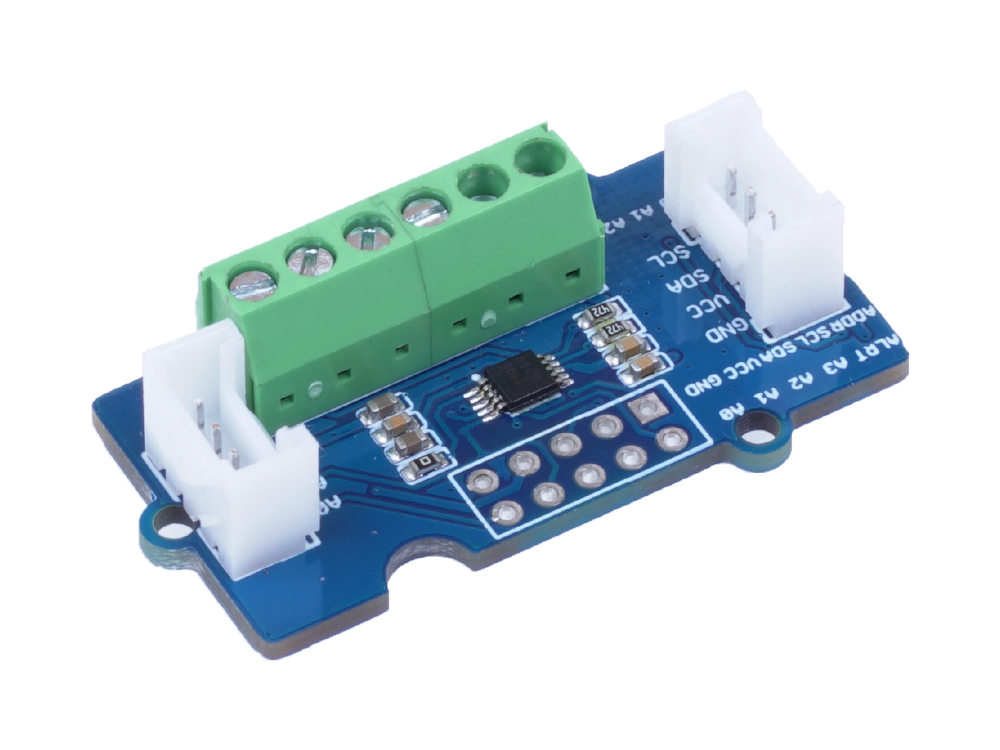

# Grove - 4 Channel 16-bit ADC (ADS1115)



[https://wiki.seeedstudio.com/Grove-16-bit-ADC-ADS1115/](https://wiki.seeedstudio.com/Grove-16-bit-ADC-ADS1115/)

## Simple library

```python
''' Simple ADS1115 library

David THERINCOURT - 2022/05

This provides
The MIT License (MIT)

  Permission is hereby granted, free of charge, to any person obtaining a copy
  of this software and associated documentation files (the "Software"), to deal
  in the Software without restriction, including without limitation the rights
  to use, copy, modify, merge, publish, distribute, sublicense, and/or sell
  copies of the Software, and to permit persons to whom the Software is
  furnished to do so, subject to the following conditions:

  The above copyright notice and this permission notice shall be included in
  all copies or substantial portions of the Software.

  THE SOFTWARE IS PROVIDED "AS IS", WITHOUT WARRANTY OF ANY KIND, EXPRESS OR
  IMPLIED, INCLUDING BUT NOT LIMITED TO THE WARRANTIES OF MERCHANTABILITY,
  FITNESS FOR A PARTICULAR PURPOSE AND NONINFRINGEMENT. IN NO EVENT SHALL THE
  AUTHORS OR COPYRIGHT HOLDERS BE LIABLE FOR ANY CLAIM, DAMAGES OR OTHER
  LIABILITY, WHETHER IN AN ACTION OF CONTRACT, TORT OR OTHERWISE, ARISING FROM,
  OUT OF OR IN CONNECTION WITH THE SOFTWARE OR THE USE OR OTHER DEALINGS IN
  THE SOFTWARE.
'''

from machine import I2C

class ADS1115():

    def __init__(self, i2c, add, Vmax=6.144, Nmax=32767, conf=b'\xC0\x83'):
        ''' 
        Default : A0 to GND | PGA = 6.144V | 15 bits | 128 SPS | Disable comparator

        Config Register (16 bits) :
        - OS (1 bit = 0) + Input multiplexer configuration (3 bit) :
        0xC = A0 - Ground | 0xD = A1 - Ground  | 0x0 = A0 - A1
        - Programmable Gain Amplifier configuration (3 bit) + Continuous convertion mode (1 bit = 0) :
        0x0 = 6.144V | 0x2 = 4.096V | 0x4 = 2.048V | 0x6 = 1.024V | 0x8 = 0.512V | 0x10 = 0.256V
        - Data rate configuration (3 bit) + Comparator hysteresis mode (1 bit = 0) :
        0x8 = 128 SPS | 0x0 = 8 SPS | 0x2 = 16 SPS | 0x4 = 32SPS | 0x6 = 64SPS | ...
        - Comparator configuration (4 bit) :
        0x3 = Disable comparator
        '''

        self.__i2c = i2c
        self.__address = add          # I2C adress
        self.v_max = Vmax             # Max voltage
        self.n_max = Nmax             # Max conversion
        self.config = conf            # Config register
        i2c.writeto_mem(add, 1, conf) # Write config register


    def read(self):
        ''' Read 15 bits conversion positive value
        '''
        buf = i2c.readfrom_mem(self.__address, 0, 2) 
        return buf[0]<<8 | buf[1]

    def read_voltage(self):
        ''' Conversion value to voltage
        '''
        return self.read()*self.v_max/self.n_max
```

Test on Adafruit STM32F405 Feather :

```python
>>> from machine import I2C
>>> i2c = I2C(1) 
>>> i2c.scan()
[72]      # 72 = 0x48
>>> from ads1115 import ADS1115
>>> can = ADS1115(i2c, 0x48)
>>> can.read()
14136
>>> can.read_voltage()
2.6505
>>> can.n_max
32768
>>> can.v_max
6.144
>>> can.config
b'\xc0\x83'
```

## Without library

```python
from machine import I2C, Pin

#i2c = I2C(freq=400000, sda=21, scl=22)           # ESP32 M5Stack
#i2c = I2C(freq=400000, sda=23, scl=22)           # ESP32 Feather
i2c = I2C(1)                                      # STM32F405 Feather
add = 0x48

i2c.writeto_mem(add, 1, b'\xC2\x85')  # Read on A0

buf = i2c.readfrom_mem(add, 0, 2)
print(buf)
print(bin(buf[0]<<8),bin(buf[1]))
N = buf[0]<<8 | buf[1]
print(N)
U = N*4.096/32767
print(U)
```
