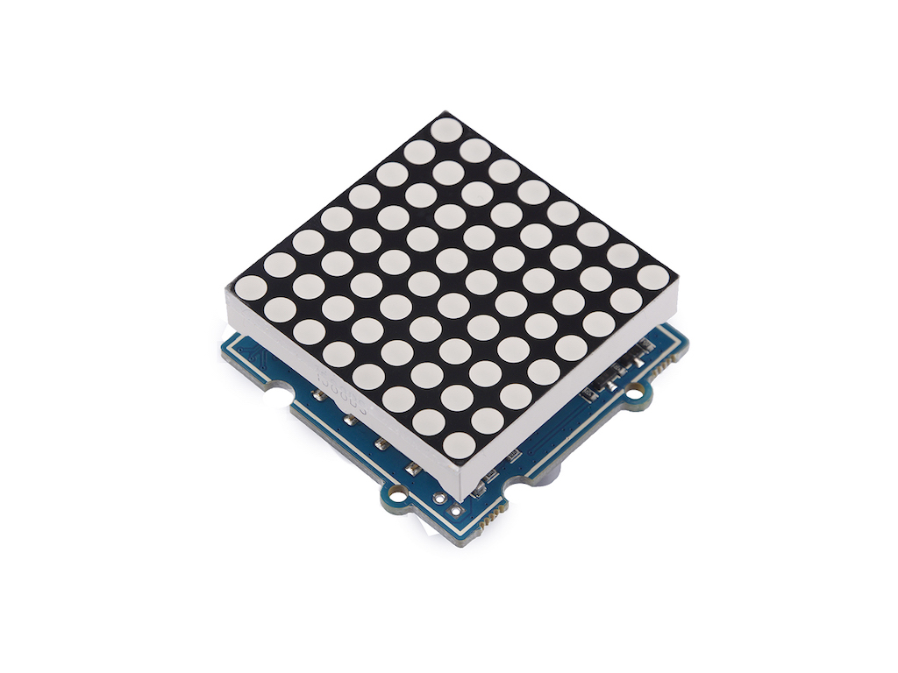

# Grove LED Matrix Driver (HT16K33)



## Drivers

[https://micropython-ht16k33.readthedocs.io/en/latest/#](https://micropython-ht16k33.readthedocs.io/en/latest/#)

[https://github.com/hybotics/Hybotics_Micropython_HT16K33](https://github.com/hybotics/Hybotics_Micropython_HT16K33)

## Erreur de décalage en x

Modification de la classe `Matrix8x8`. 

```python
class Matrix8x8(HT16K33Matrix):
    WIDTH = 8
    HEIGHT = 8
    FORMAT = framebuf.MONO_HLSB
    FB_BPP = 1

    def _copy_buf(self):
        for y in range(8):
            b = self._fb_buffer[y]
            self.buffer[y * 2] = (b >> 0) | (b << 8)
```

## Test

```python
from machine import I2C, Pin
from ht16k33_matrix import Matrix8x8
from time import sleep

i2c = I2C(freq=400000, sda=Pin(23), scl=Pin(22))  # Feather ESP32

mat = Matrix8x8(i2c)

for j in range(8):
    for i in range(8):
        mat.pixel(i,j,1)
        mat.show()
        sleep(.5)
        mat.pixel(i,j,0)
```

