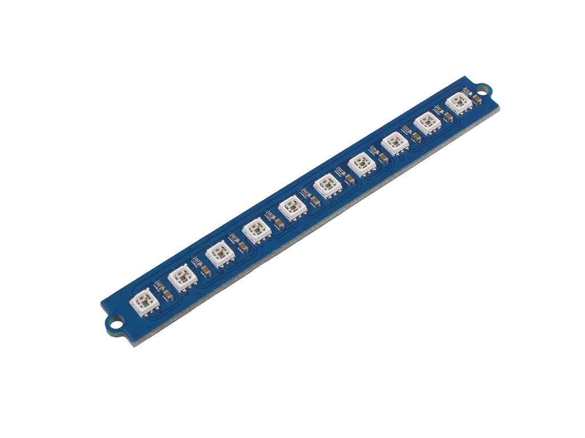
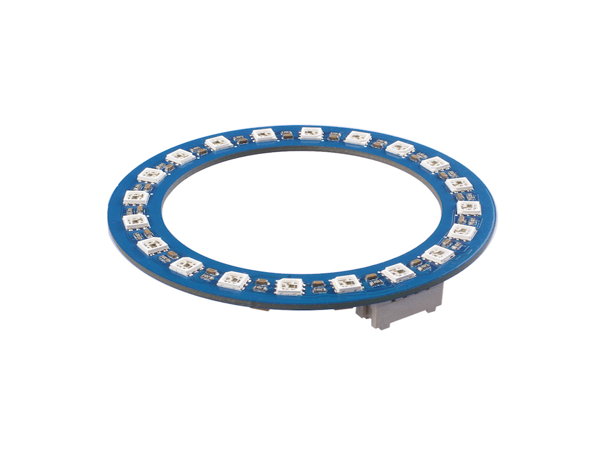

# Grove Stick LED RGB (WS2813)





Tester avec ESP32 + MicroPython

## Programme

Avec le module NeoPixel

``` python
from machine import Pin
from neopixel import NeoPixel

pin = Pin(0, Pin.OUT)   # set GPIO0 to output to drive NeoPixels
np = NeoPixel(pin, 20)   # create NeoPixel driver on GPIO0 for 8 pixels
np[0] = (255, 255, 255) # set the first pixel to white
np.write()              # write data to all pixels
r, g, b = np[0]         # get first pixel colour
```