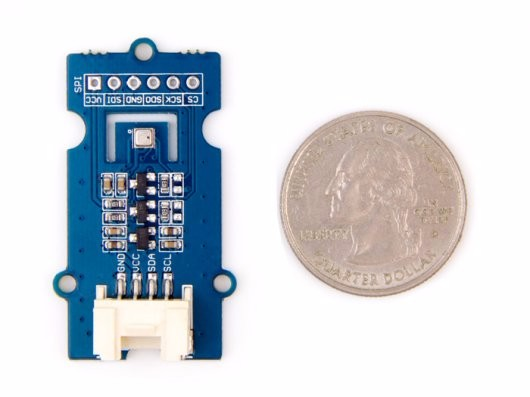

# Grove - Barometer Sensor (BME280)



[https://wiki.seeedstudio.com/Grove-Barometer_Sensor-BME280/](https://wiki.seeedstudio.com/Grove-Barometer_Sensor-BME280/)


|Type        | Plage          | Précision absolue   | Précision relative |
|------------|----------------|---------------------|--------------------|
|Pression    |300 - 1100 hPa  | ±1.0 hPa            | ±0.12 hPa (±1 m)   |
|Température |-40 - 85 ℃     | ±1.0°C              |                    |
|Humidité    |0% - 100%       | ±3%                 |                    |


## Library

[https://github.com/neliogodoi/MicroPython-BME280](https://github.com/neliogodoi/MicroPython-BME280)

Fichier `bme280.py` à téléverser sur la carte.

## Test

Programme de test sur une carte Adafruit HUZZAH32 – ESP32 Feather Board.

```python
# Test on Adafruit HUZZAH32 – ESP32 Feather Board
import bme280
from machine import I2C, Pin

i2c = I2C(sda=Pin(23), scl=Pin(22))

sensor = bme280.BME280(i2c=i2c)
sensor.formated_values

print(sensor.pressure/100, "hPa")
print(sensor.temperature, "°C")
print(sensor.humidity, "%")
```

Résultats :

```python
982.2575 Pa
27.74 °C
50.27442 %
```

