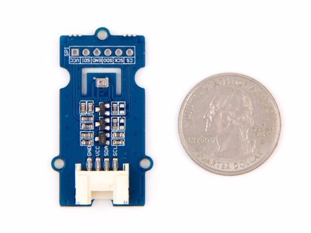

# Grove - Barometer Sensor (BMP280)

## Description



[https://wiki.seeedstudio.com/Grove-Barometer_Sensor-BMP280/](https://wiki.seeedstudio.com/Grove-Barometer_Sensor-BMP280/)

|Type        | Plage          | Précision absolue    | Précision relative |
|------------|----------------|----------------------|--------------------|
|Pression    |300 à 1100 hPa  | ±1.0 hPa             | ±0.12 hPa (±1 m)   |
|Température |-40 à +85 °C    | ±1.0°C               |                    |

## Librairie

[https://github.com/dafvid/micropython-bmp280](https://github.com/dafvid/micropython-bmp280)

Fichier `bmp280.py` à téléverser sur la carte.

## Test

```python
# Test on Adafruit HUZZAH32 – ESP32 Feather Board
from machine import I2C, Pin
from bmp280 import *

i2c = I2C(sda=Pin(23), scl=Pin(22))
bmp = BMP280(i2c, addr=0x77)

print(bmp.temperature, "°C")
print(bmp.pressure/100, "hPa")
```

Résultats :

```python

```