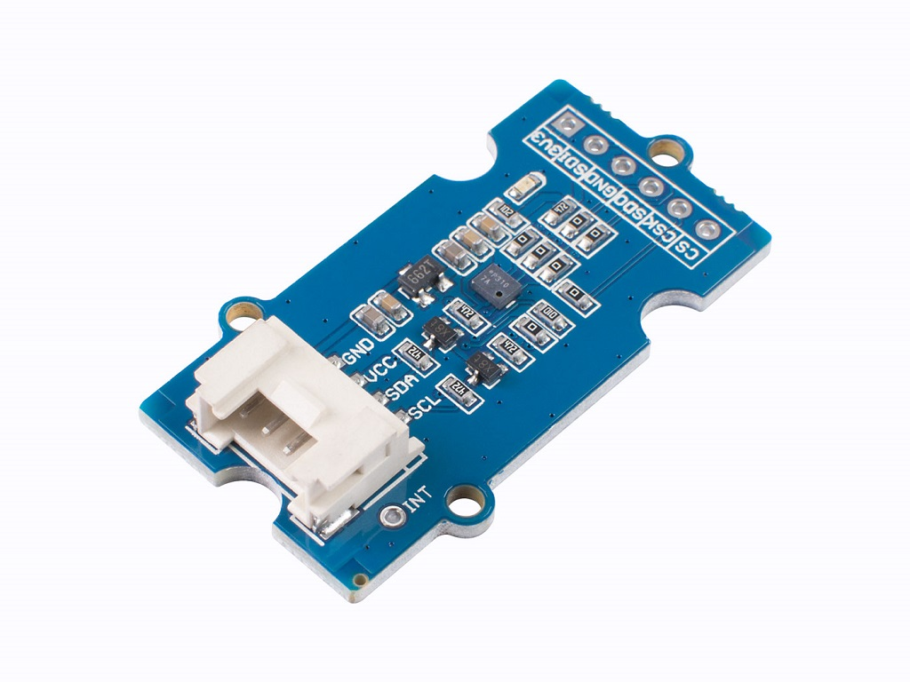

# Grove - High Precision Barometric Pressure Sensor DPS310



[https://wiki.seeedstudio.com/Grove-High-Precision-Barometric-Pressure-Sensor-DPS310/](https://wiki.seeedstudio.com/Grove-High-Precision-Barometric-Pressure-Sensor-DPS310/)

|Type        | Plage          | Précision absolue   | Précision relative       |
|------------|----------------|---------------------|--------------------------|
|Pression    |300 à 1200 hPa  | ± 1 hPa (or ±8 m)   | ± 0.002 hPa (or ±0.02 m) |
|Température |-40 - 85 ℃     | ± 0.5°C             |                          |

## Fonctionnement

Mesure de pression basé sur un capteur de type MEMS. La mesure de pression est compensée par des coefficients détermimés en usine et enregistrés en mémoire (registres `0x10` à ). Deux capteurs ASIC ou MEMS mesurent la température interne du capteur. Les coefficients C0 et C1 sont valables uniquement pour un des deux capteurs précisé dans le registre `0x28` . 
$$
T_{comp}(°C) =\dfrac{c0}{2} + c1\times T_{raw\_sc} \qquad\text{avec}\qquad T_{raw\_sc}=\dfrac{T_{raw}}{k_T}
$$
La mesure de pression est donnée par la relation :
$$
P_{comp}(Pa) = c00 + P_{raw\_rc}(c10+P_{raw\_sc}\times c30)+T_{raw\_sc}\times c01 + T_{raw\_sc}\times P_{raw\_sc}\times (c11+P_{raw\_sc}\times c21)
$$
avec
$$
P_{raw_sc}=\dfrac{P_{raw}}{k_P}
$$

## Principe de mesure

### Configuration du capteur

- Lecture des registres `0x10` à ` 0x21` pour obtenir les coefficients c0 à c30 (complément à $2^n$) .
- Ecriture du registre `0x06` pour la configuration de la mesure de pression (ex. `0x66`)
- Fixer le facteur `kT` en fonction de la configuration précédente (voir table 9 du datasheet).
- Ecriture du registre `0x07` pour la configuration de la mesure de température (ex. `0xE6`)
- Fixer le facteur `kP` en fonction de la configuration précédente  (voir table 9 du datasheet). 
- Ecriture du registre `0x09` pour activer le «shift result»  (ex. `0x0C` )

### Mesure

- Ecriture du registre `0x08` avec la valeur `0x02`  pour une mesure de température.
- Lecture de la **température brute** (complément à $2^n$) dans les registres `0x03` à ` 0x05`.
- Calcul de la température en °C.
- Ecriture du registre `0x08` avec la valeur `0x01`  pour une mesure de pression.
- Lecture de la **pression brute** (complément à $2^n$)  dans les registres `0x00` à ` 0x02`.
- Calcul de la pression en pascal.

### Mesures en continu (background mode)

Ecriture du registre `0x08` avec la valeur `0x07`  pour une mesure de pression et de température en continu.

## Exemple

```python
from machine import I2C, Pin
from time import sleep_ms
import math

def twos_complement(val, bits):
        if val & (1 << (bits - 1)):
            val -= 1 << bits
        return val

def read_coeffs():
    global c0, c1, c00, c10, c01, c11, c20, c21, c30
    buf = i2c.readfrom_mem(add, 0x10, 18)
    c0 = (buf[0] << 4) | ((buf[1] >> 4) & 0x0F)
    c0 = twos_complement(c0, 12)
    c1 = ((buf[1] & 0x0F) << 8) | buf[2]
    c1 = twos_complement(c1, 12)
    c00 = (buf[3] << 12) | (buf[4] << 4) | ((buf[5] >> 4) & 0x0F)
    c00 = twos_complement(c00, 20)
    c10 = ((buf[5] & 0x0F) << 16) | (buf[6] << 8) | buf[7]
    c10 = twos_complement(c10, 20)
    c01 = (buf[8] << 8) | buf[9]
    c01 = twos_complement(c01, 16)
    c11 = (buf[10] << 8) | buf[11]
    c11 = twos_complement(c11, 16)
    c20 = (buf[12] << 8) | buf[13]
    c20 = twos_complement(c20, 16)
    c21 = (buf[14] << 8) | buf[15]
    c21 = twos_complement(c21, 16)
    c30 = (buf[16] << 8) | buf[17]
    c30 = twos_complement(c30, 16)
    
def config():
    i2c.writeto_mem(add, 0x06, b'\x66')  # PRS_CFG = 0x66
    i2c.writeto_mem(add, 0x07, b'\xE6')  # TMP_CFG = 0x66 (b7 = 1 Internal temp sensor MEMS)
    i2c.writeto_mem(add, 0x09, b'\x0C')  # CFG_REG = 0x0C

def read_raw_scale_temp():
    buf = i2c.readfrom_mem(add, 0x03, 3)
    t_raw = (buf[0] << 16) | (buf[1] << 8) | buf[2]
    t_raw = twos_complement(t_raw, 24)
    return t_raw/1040384
    
def read_temperature():
    t_raw_sc = read_raw_scale_temp()
    return c0*0.5 + c1*t_raw_sc

def read_pressure():
    t_raw_sc = read_raw_scale_temp()
    buf = i2c.readfrom_mem(add, 0x00, 3)
    p_raw = (buf[0] << 16) | (buf[1] << 8) | buf[2]
    p_raw = twos_complement(p_raw, 24)
    p_raw_sc = p_raw/1040384
    return c00 + p_raw_sc*(c10 + p_raw_sc*(c20 + p_raw_sc*c30)) + t_raw_sc*c01 + t_raw_sc*p_raw_sc*(c11 + p_raw_sc*c21)

def read_altitude(sea_level_pressure = 101325):
    pressure = read_pressure()
    return 44330 * (1.0 - math.pow(pressure / sea_level_pressure, 0.1903))

i2c = I2C(freq=400000, sda=Pin(23), scl=Pin(22))  # Feather ESP32
add = 0x77

read_coeffs()
config()
i2c.writeto_mem(add, 0x08, b'\x07')  # MEAS_CFG = Continous pressure end temperature measurement

temperature = read_temperature()
print('Temperature (°C) =', temperature)

pressure = read_pressure()
print('Pressure (Pa) =', pressure)

altitude = read_altitude()
print('Altitude (m) =', altitude)
```

